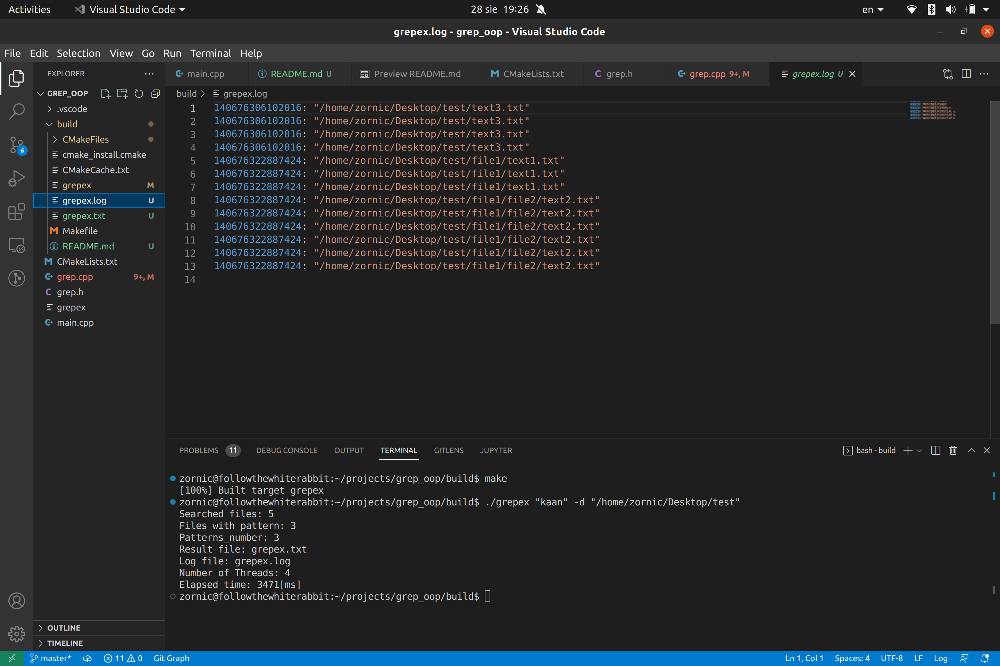

# build instructions  
```
mkdir build && cd build 
cmake ..
make 
./grepex "word" -d "directory_name" -l log_file_name -r result_file_name -t [number_of_threads]
```
# or 

```
g++ -std=c++17 -pthread grep.cpp main.cpp -o grepex
./grepex "word" -d "directory_name" -l log_file_name -r result_file_name -t [number_of_threads]
```


<p align="center">
  
  
</p>

